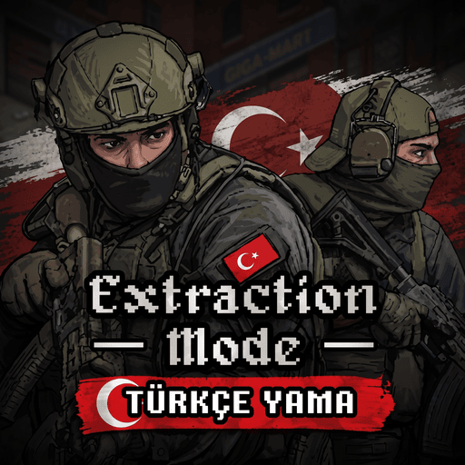

# Extraction Mode - Türkçe Çeviri [Build 42]



Bu proje, **Project Zomboid (Build 42)** için geliştirilen popüler **[Extraction Mode](https://steamcommunity.com/sharedfiles/filedetails/?id=3785397275)** modunun kapsamlı ve özenle hazırlanmış Türkçe yerelleştirme yamasıdır.

Çeviri ve yerelleştirme: **dope**  
Orijinal mod yapımcısı: **Zakreon**

---

## Çevrilen İçerikler

- **Oyun İçi Arayüz ve Bildirimler (HUD):** Helikopter iniş/tahliye süreleri, baskın sayaçları, anlık durum ve telsiz mesajları.
- **Sığınak (Hideout) Altyapısı:** Jeneratör yönetimi, araç liftleri, sığınak ısıtma ve havalandırma sistemleri, tüm sığınak geliştirme açıklamaları.
- **Görevler & Diyaloglar:** Tüm hikaye görevleri, hedefler ve telsiz konuşmaları.
- **Tüccarlar / Bağlantılar (Contacts) & Takas:** Franklin Porch, Kıdemli Başçavuş Graves, Silas "Fare" Mercer ve diğer karakterlerle yapılan takaslar ve güven seviyeleri.
- **Mod Eşyaları:** Tıbbi malzemeler, ceset torbası, numuneler (*Hasta Sıfır Numunesi* vb.), inşaat planları ve işaret fişeği mühimmatları.
- **Kapsamlı Sandbox Ayarları:** Sunucu yöneticileri ve solo oyuncular için tüm sandbox ayarları ve detaylı açıklamaları.
- **Oyun Modları Terminolojisi:** Oyuncuların alışık olduğu *Coop*, *PvP*, *Serbest Dolaşım* gibi oyun yapısı terimleri korunarak en doğal oyun deneyimi sağlanmıştır.

---

## Kurulum

### Yöntem 1: Steam Atölyesi (Önerilen)
1. Steam Atölyesi'nden mod sayfasına gidin ve **Abone Ol** butonuna tıklayın.
2. Orijinal **[Extraction Mode](https://steamcommunity.com/sharedfiles/filedetails/?id=3785397275)** moduna da abone olduğunuzdan emin olun.
3. Project Zomboid'i açın, **MODS (Modlar)** menüsünden her iki modu da aktif edin.
4. **Seçenekler > Görüntü** sekmesinden oyun dilinizi **Türkçe** olarak ayarlayın.

### Yöntem 2: Manuel Kurulum (GitHub)
1. Bu depoyu indirin (`Code` -> `Download ZIP`).
2. İndirdiğiniz klasörü `Extraction_Turkish_Translation` adıyla `C:\Users\<KullanıcıAdınız>\Zomboid\mods\` dizinine çıkarın.
3. Oyunu açıp modlar menüsünden aktifleştirin.

---

## Katkıda Bulunma (Pull Request)

Bu çeviri projesi açık kaynaklıdır ve topluluk katkılarına açıktır. Gözünüze çarpan bir yazım hatası, daha iyi bir terim önerisi veya yeni bir mod güncellemesiyle gelen eksik bir çeviri varsa katkıda bulunabilirsiniz!

1. Bu depoyu **Fork**'layın.
2. Kendi reponuzda yeni bir dal (branch) açın:
   ```bash
   git checkout -b ceviri-iyilestirmesi
   ```
3. İlgili JSON dosyasında (`42/media/lua/shared/Translate/TR/`) düzenlemenizi yapın.
4. Değişikliklerinizi commit'leyin ve push'layın:
   ```bash
   git commit -m "Düzeltme: X görevindeki yazım hatası giderildi"
   git push origin ceviri-iyilestirmesi
   ```
5. GitHub üzerinden bir **Pull Request (PR)** oluşturun.

### Çeviri Kuralları
- **Değişkenleri Bozmayın:** Metinler içindeki `%1`, `%2`, `%%`, `<LINE>`, `<RGB:...>`, `<SIZE:...>` gibi kod ve biçimlendirme etiketlerini kesinlikle değiştirmeyin.
- **Oyun Terimleri:** `Coop`, `PvP` gibi uluslararası kabul görmüş oyuncu terimleri Türkçe'ye zorlama çevrilmemeli (örneğin *Kooperatif* yapılmamalı), olduğu gibi bırakılmalıdır.
- **Karakter Kodlaması:** Tüm dosyalar **UTF-8** kodlamasında kaydedilmelidir.
- **JSON Sözdizimi:** Çift tırnaklar ve virgül kurallarına dikkat edilmelidir.

---

## Destek ve Geri Bildirim

Modu beğendiyseniz Steam Atölye sayfasında **Beğen (Thumbs Up)** ve **Favorilere Ekle** butonlarıyla destek olmayı unutmayın!

- Steam Atölye Sayfası: *(Yüklendikten sonra bağlantı eklenecektir)*
- Hata Bildirimi: [GitHub Issues](../../issues) veya Steam Tartışmaları

---

## Lisans & Teşekkür

- Çeviri ve Yerelleştirme: **dope**
- Orijinal Mod & Telif: **Zakreon** (*Extraction Mode* modunun tüm kod ve içerik hakları orijinal yapımcısına aittir).
